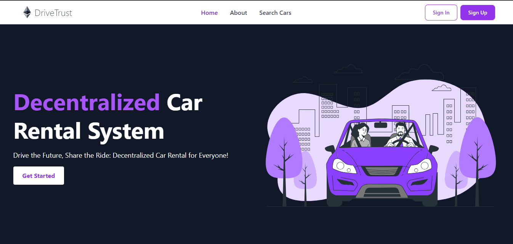
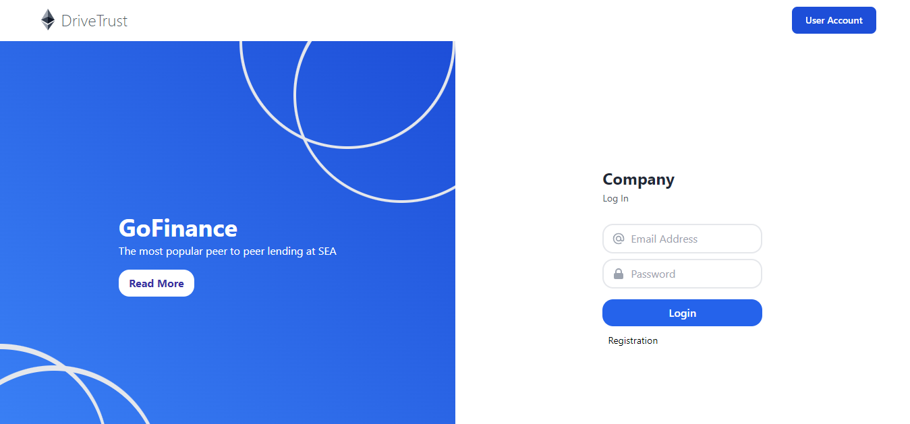
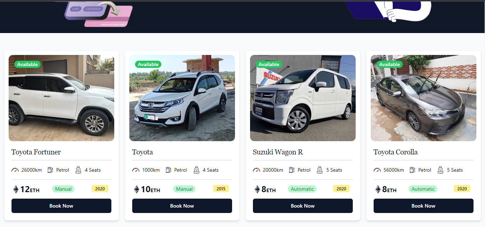
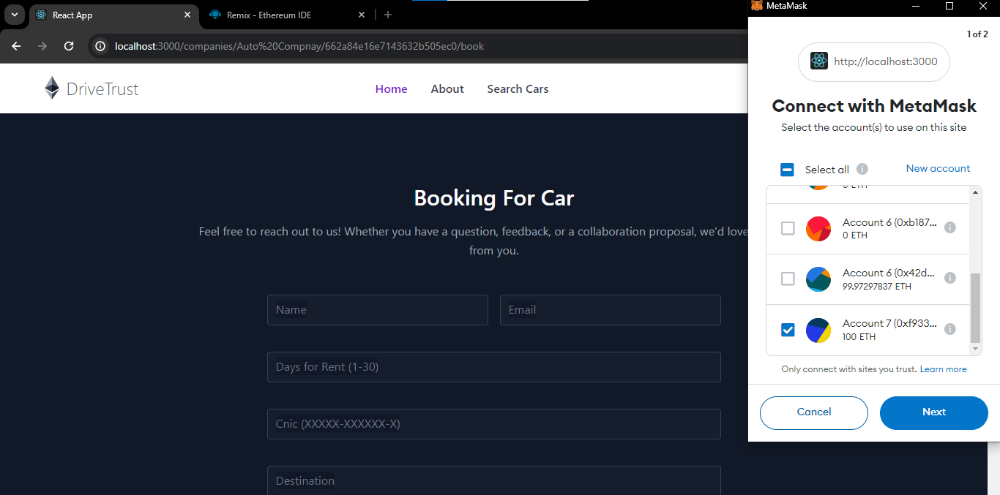
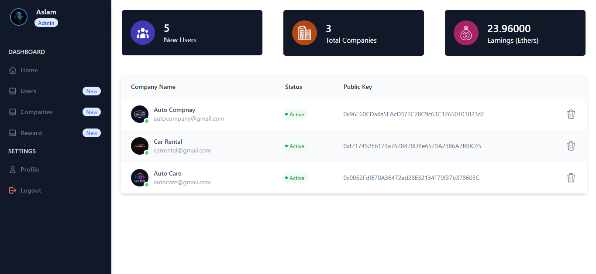

# 🚗 Drive Trust - Blockchain-Powered Car Rental Platform

## 📌 Project Description
**Drive Trust** is a **Car Rental Platform with Blockchain Integration** — a full-stack web application that enables users to rent cars from various companies while leveraging **Ethereum smart contracts** for secure transactions and transparent agreements.  

The system ensures **trust, transparency, and immutability** by recording rental agreements on the blockchain while providing a smooth web experience for both users and companies.

- CarRental.sol smart contract.
- React frontend with pages for users, companies, and admin.
- Node.js backend with controllers for authentication and car management.
- Both user and company authentication systems.
- Admin panel functionality.

---

## 🛠️ Technology Stack
- **Frontend:** React.js, React Router  
- **Backend:** Node.js, Express.js  
- **Database:** MongoDB with Mongoose ODM  
- **Blockchain:** Ethereum Smart Contracts (Solidity) with Hardhat  
- **Authentication:** Session-based, bcrypt for password hashing  
- **File Uploads:** Multer (car images, CNIC documents)  
- **Email Service:** Nodemailer for notifications  

---

## 🚀 How to Run the Project

### 📌 Prerequisites
- [Node.js](https://nodejs.org/) (v14 or higher)  
- [MongoDB](https://www.mongodb.com/) (running locally on port `27017`)  
- [Ganache](https://trufflesuite.com/ganache/) (Ethereum blockchain simulator)  
- [MetaMask](https://metamask.io/) browser extension  

---
## ⚙️ Installation & Setup

### 1️⃣ Clone Repository
```bash
git clone https://github.com/salmanmasroor/Drive-Trust-DApp.git
cd Drive-Trust-DApp
```

### 2️⃣ Backend Setup
```bash
cd server
npm install
npm start
```

### 3️⃣ Frontend Setup
```bash
cd client
npm install
npm start
```
### 4️⃣ Blockchain Setup
```bash
cd client
npx hardhat compile
npx hardhat run ignition/modules/Lock.js --network ganache
```

🔑 Key Features
👤 User Management

Registration with OTP email verification

Secure login with sessions

Profile & CNIC verification (with image upload)




🏢 Company Management

Company registration & verification

Manage car inventory

Handle booking requests

Revenue tracking




🚙 Car Rental System

Browse cars from multiple companies

Search & filter functionality

View car details & availability

Booking requests with offers




🔗 Blockchain Integration

Smart contract for rental agreements

Transactions recorded on Ethereum blockchain

Time-based rental management

Transparent booking history




🛠️ Admin Dashboard

Manage users & companies

Revenue & payments tracking

Analytics & statistics

Reward system




🔒 Security Features

Session-based authentication

File upload validation

OTP verification

Input sanitization

CORS protection

✨ Additional Features

Email notifications (e.g., booking confirmations)


